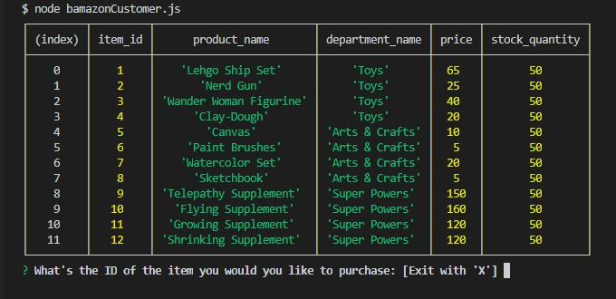
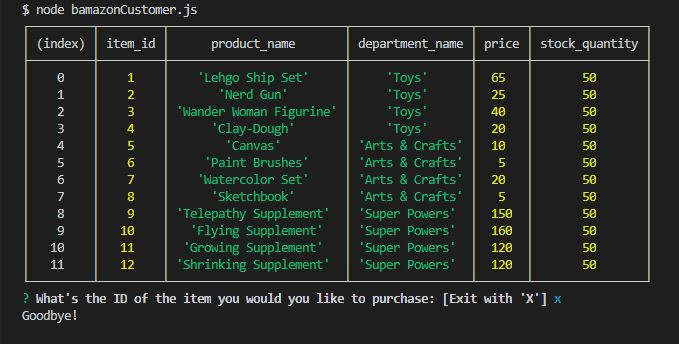
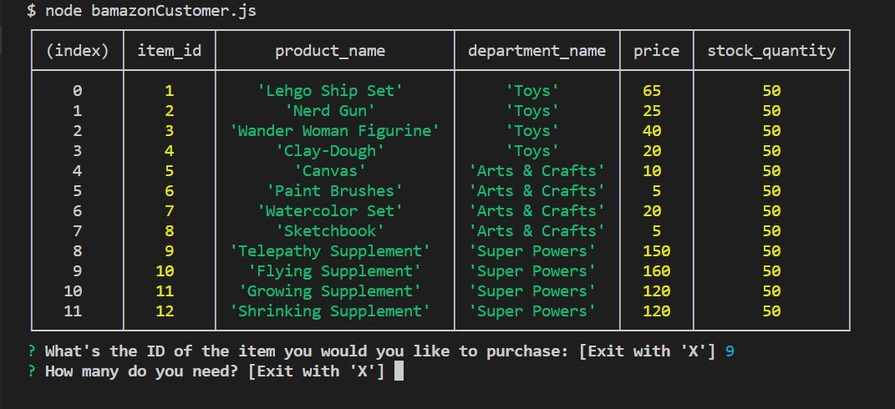
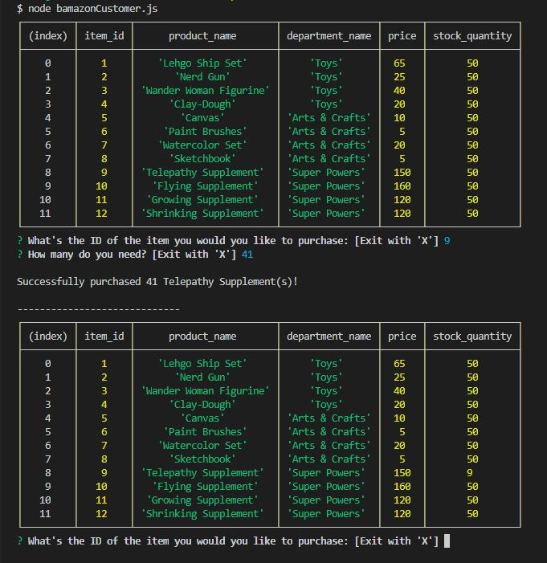
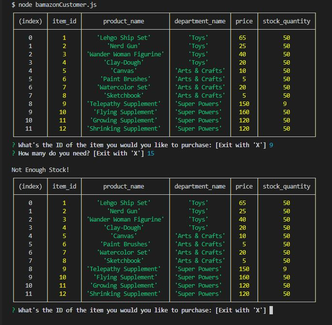

# Bamazon Storefront App

Bamazon on GitHub https://github.com/Unikwalk/Bamazon

## Project Descriptions:

Bamazon is like Amazon with a B for BUT it carries much much much cooler stuff! 

The app will take in orders from customers and deplete stock from the store's inventory. The app is programmed to track product sales across the store's departments and then provide a summary of the highest-grossing departments in the store.

### Customer View:

When the bamazonCustomer.js file is called, using `node bamazonCustomer.js`, it will display a complete list of all products, departments, pricing, and current inventory. 

Users has 2 options: Choose to exit by typing 'X' or choose the product by typing in its `item_id`.

* If user types 'X', the app will say "Goodbye" and display the complete list again.
* If user types in an item id, the app will provide 2 options: To exit or to enter a quantity.
* If an item id is provided, the app will compare the quantity against the inventory level:
    * If the required quantity is less than inventory, purchase will be made and inventory wil be deducted. The app will inform user and display the list again, this time with updated inventory for that item.
    * If the quantity is more than inventory, purchase will not be made and the app will display the complete list again.

When the bamazonCustomer.js file is called, using `node bamazonCustomer.js`, it will display a complete list of all products:

Choose to exit by typing 'X': 

Choose the product by typing in its `item_id`(Ex: 9):

Choose quantity and purchase is successful, app will display list with updated inventory for that item.
You can see that stock_quantity is now 9 after 41 was deducted from 50 for item id 9:

Choose quantity and purchase is unsuccessful, app will yell at customer. Since requested quantiy (15) is more than inventory (9), the app will display the list and ask user again.

## Technologies Used:
* JavaScript
* Node.js
* NPM packages
* MySQL

